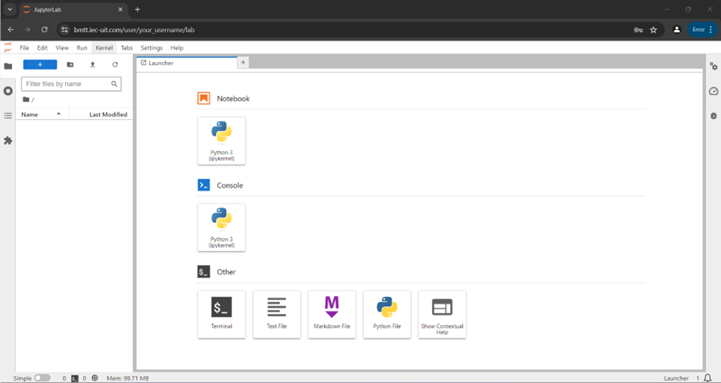

# Bắt đầu nhanh với JupyterHub Server

### MỤC LỤC

* A. Giới thiệu về JupyterHub
  * 1\. Tại sao sử dụng JupyterHub?
  * 2\. Bắt đầu với JupyterHub
* B. Làm việc với Jupyter Notebook/Lab
  * 1\. Tạo một Notebook mới
  * 2\. Quản lý môi trường làm việc
  * 3\. Một số mẹo và thủ thuật hữu ích
* C. Tài liệu tham khảo

### A. Giới thiệu về JupyterHub

**JupyterHub** là một nền tảng mạnh mẽ cho phép nhiều người dùng cùng truy cập và sử dụng Jupyter Notebook hoặc JupyterLab trên một máy chủ chung. Nền tảng này đặc biệt hữu ích trong các lĩnh vực giảng dạy, nghiên cứu và cộng tác trong các dự án khoa học dữ liệu.

#### 1. Tại sao sử dụng JupyterHub?

* **Cộng tác:** Tạo điều kiện lý tưởng để chia sẻ notebook, dữ liệu và tài nguyên tính toán giữa các thành viên trong nhóm.
* **Tiện lợi:** Người dùng có thể làm việc từ bất kỳ đâu với trình duyệt web và kết nối internet.
* **Quản lý tài nguyên:** Quản trị viên có thể kiểm soát tài nguyên (CPU, RAM, GPU) được phân bổ cho mỗi người dùng.
* **Dễ dàng triển khai:** Hỗ trợ triển khai trên nhiều nền tảng khác nhau, từ máy chủ đơn lẻ đến các cụm máy tính lớn.

#### 2. Bắt đầu với JupyterHub

1. Mở trình duyệt web và nhập địa chỉ của JupyterHub, ví dụ: `https://bmtt.iec-uit.com/`.
2. Nhập tên người dùng và mật khẩu được cung cấp.
3. Sau khi đăng nhập, bạn sẽ thấy trang chủ của JupyterHub, nơi bạn có thể bắt đầu công việc.

<figure><figcaption></figcaption></figure>

### B. Làm việc với Jupyter Notebook/Lab

#### 1. Tạo một Notebook mới

* Nhấn vào nút **"New"**, sau đó chọn **"Python 3"** trong mục Notebook.

<figure><figcaption></figcaption></figure>

*   Trong Jupyter Notebook/Lab:

    * Viết mã trong các ô (cell) và chạy từng ô riêng lẻ bằng cách nhấn tổ hợp phím `Ctrl + Enter`.

    <figure><figcaption></figcaption></figure>

    * Lưu công việc bằng cách nhấn nút **Save** hoặc sử dụng tổ hợp phím `Ctrl + S`.

    <figure><figcaption></figcaption></figure>
* Để mở lại các notebook đã có, chỉ cần nhấp vào tên file trong danh sách tệp.

#### 2. Quản lý môi trường làm việc

*   Để quản lý cửa sổ làm việc và các **kernel** đang chạy, chúng ta vào biểu tượng ở góc trái màn hình để mở danh sách các cửa sổ và kernel.

    * Mở lại các cửa sổ đã đóng.
    * **Shut down** các kernel không cần thiết.

    <figure><figcaption></figcaption></figure>
*   Sử dụng thanh công cụ để:

    * Lưu file.
    * Thêm dòng code mới.
    * Khởi động lại kernel.
    * Chạy cell.
    * Ngắt kernel, v.v.

    <figure><figcaption></figcaption></figure>

#### 3. Một số mẹo và thủ thuật hữu ích

*   **Cài đặt thư viện:**

    * Sử dụng `pip` hoặc `conda` để cài đặt các thư viện Python cần thiết cho công việc.

    <figure><figcaption></figcaption></figure>
*   **Sử dụng terminal trong Jupyter Notebook/Lab:**

    * Mở terminal để thực hiện các lệnh hệ thống:
    * Thực thi lệnh trong terminal
    * **Kiểm tra tài nguyên GPU:** Sử dụng lệnh `nvidia-smi`.

    <figure><figcaption></figcaption></figure>

    * **Kiểm tra RAM và chương trình đang chạy:** Sử dụng lệnh `htop`.

    <figure><figcaption></figcaption></figure>

***

### C. Tài liệu tham khảo

* Trang chủ JupyterHub: [https://jupyter.org/hub](https://jupyter.org/hub)
* Tài liệu JupyterHub: [https://jupyterhub.readthedocs.io/en/stable/](https://jupyterhub.readthedocs.io/en/stable/)

